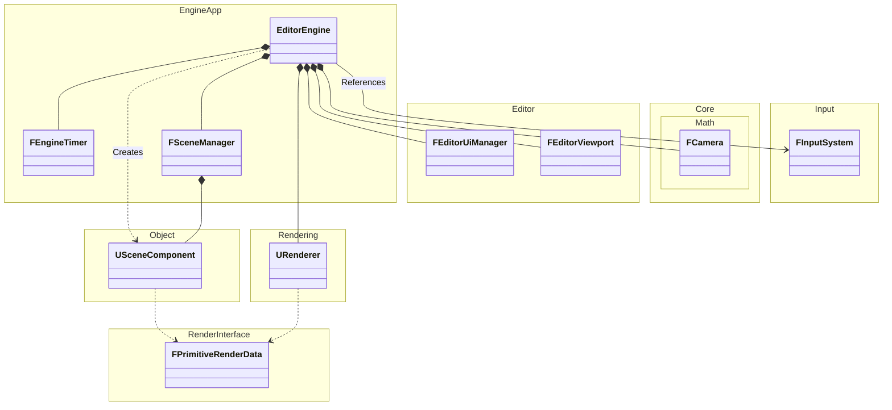

## Editor Engine Class Diagram

```mermaid
classDiagram

namespace EngineApp {
	class EditorEngine
	class FEngineTimer
	class FSceneManager
}

namespace Rendering {
	class URenderer
}

namespace Editor {
	class FEditorUiManager
	class FEditorViewport
}

namespace Core.Math {
	class FCamera
}

namespace Object {
	class USceneComponent
}

namespace RenderInterface {
	class FPrimitiveRenderData
}

namespace Input {
	class FInputSystem
}

EditorEngine *-- FEngineTimer
EditorEngine *-- URenderer
EditorEngine *-- FEditorUiManager
EditorEngine *-- FSceneManager
EditorEngine *-- FEditorViewport
EditorEngine *-- FCamera
EditorEngine --> FInputSystem : References

EditorEngine ..> USceneComponent : Creates
FSceneManager *-- USceneComponent

USceneComponent ..> FPrimitiveRenderData
URenderer ..> FPrimitiveRenderData

```