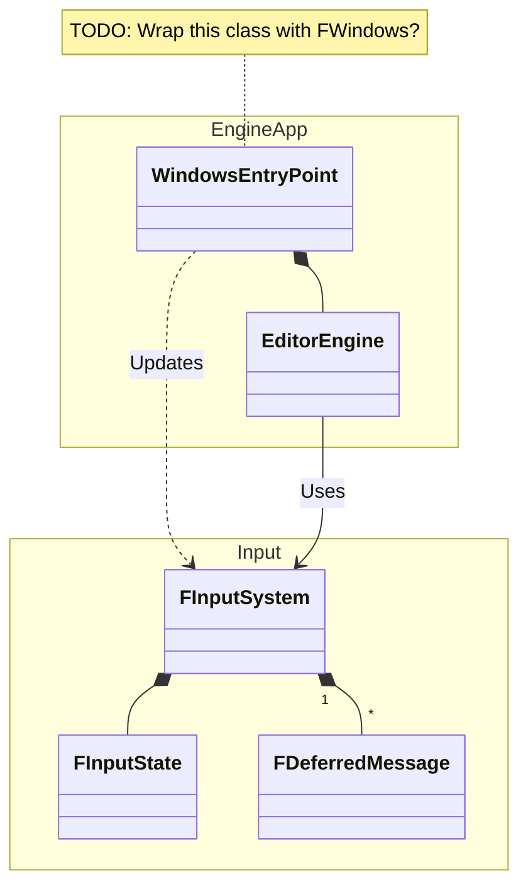

## Input System

```mermaid
classDiagram

namespace Input {
	class FInputSystem
	class FInputState
	class FDeferredMessage
}

namespace EngineApp {
	class WindowsEntryPoint
	class EditorEngine

}
note for WindowsEntryPoint "TODO: Wrap this class with FWindows?"

FInputSystem *-- FInputState
FInputSystem "1" *-- "*" FDeferredMessage

WindowsEntryPoint ..> FInputSystem : Updates
WindowsEntryPoint *-- EditorEngine
EditorEngine --> FInputSystem : Uses

```