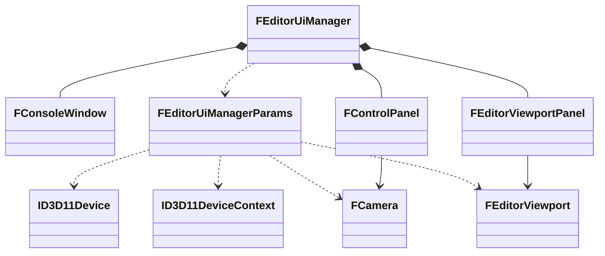

## Editor UI Manager Class Diagram

```mermaid
classDiagram

%% Self
class FEditorUiManager
struct FEditorUiManagerParams

%% Panels
class FConsoleWindow
class FControlPanel
class FEditorViewportPanel

%% Dependencies
class FCamera
class FEditorViewport
class ID3D11Device
class ID3D11DeviceContext

FEditorUiManager ..> FEditorUiManagerParams

FEditorUiManager *-- FConsoleWindow
FEditorUiManager *-- FControlPanel
FEditorUiManager *-- FEditorViewportPanel

FEditorUiManagerParams ..> ID3D11Device
FEditorUiManagerParams ..> ID3D11DeviceContext
FEditorUiManagerParams ..> FCamera
FEditorUiManagerParams ..> FEditorViewport

FControlPanel --> FCamera
FEditorViewportPanel --> FEditorViewport

```