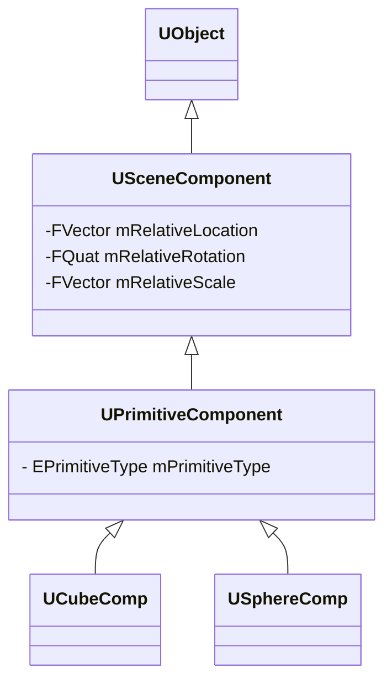

## Components Inheritance Diagram

```mermaid
classDiagram

class UObject
class USceneComponent {
	-FVector mRelativeLocation
	-FQuat mRelativeRotation
	-FVector mRelativeScale
}
class UPrimitiveComponent {
	- EPrimitiveType mPrimitiveType
}
class UCubeComp
class USphereComp

UObject <|-- USceneComponent
USceneComponent <|-- UPrimitiveComponent
UPrimitiveComponent <|-- UCubeComp
UPrimitiveComponent <|-- USphereComp
```